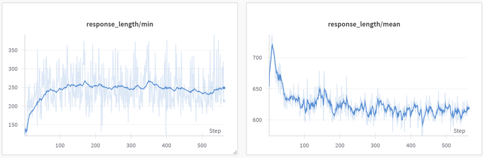

# RL-LLMs-Searching
## Table of Contents

- [Introduction](#introduction)
- [Related Work](#related-work)
- [Synthetic Task Design: Star Graph Pathfinding](#synthetic-task-design-star-graph-pathfinding)
- [Out-of-the-Box Evaluation: Qwen2.5 Instruct Models](#out-of-the-box-evaluation-qwen25-instruct-models)
- [Reinforcement Learning Fine-Tuning (RLFT) with GRPO](#reinforcement-learning-fine-tuning-rlft-with-grpo)
- [Supervised Fine-Tuning of 1.5B Model Using 14B Model Traces](#supervised-fine-tuning-of-15b-model-using-14b-model-traces)
- [SFT + RLFT: Combining Supervised and Reinforcement Learning for Structured Search](#sft--rlft-combining-supervised-and-reinforcement-learning-for-structured-search)
- [Bonus: Handholding with Partial Traces from Qwen-2.5 14B](#bonus-handholding-with-partial-traces-from-qwen-25-14b)
- [Generalization 🌟](#generalization-)
- [Work by](#work-by)


## Introduction

Graph search is a fundamental problem in computer science with applications spanning navigation, planning, knowledge retrieval, and reasoning in structured environments. Classical algorithms such as Breadth-First Search (BFS), Depth-First Search (DFS), and Dijkstra’s algorithm offer well-established procedures for specific search objectives but lack the flexibility to generalize across diverse graph structures or adapt to dynamic constraints.

In contrast, Large Language Models (LLMs) have shown emerging capabilities in algorithmic reasoning, including solving problems that resemble planning or proof construction. However, current LLMs often fall short in tasks that require **explicit planning**, **backtracking**, or **stateful exploration**. For example, when asked to construct a mathematical proof, an LLM might prematurely commit to a line of reasoning and fail to revise or explore alternatives—even when faced with contradictions or dead ends. This lack of structured search behavior highlights a key limitation in current generation strategies.

Planning is inherently a **search problem in an abstract concept space**, often requiring multiple steps of exploration, hypothesis testing, and recovery from errors. We argue that equipping LLMs with the ability to perform such abstract search—through graph traversal in latent space—is critical to unlocking their full reasoning potential. This capability has wide-ranging implications across domains such as formal verification, scientific discovery, automated tutoring, and multi-step decision making.

To address these challenges, we investigate the use of **Reinforcement Learning Fine-Tuning (RL FT)** techniques to train LLMs for structured search behavior. By casting graph search as a sequential decision-making task, RL allows LLMs to optimize for long-term outcomes, handle sparse rewards, and learn to backtrack or explore efficiently.

In this project, we focus on a controlled setting: a set of **synthetic graph-based datasets** designed to evaluate and probe these capabilities in isolation. These datasets provide structured environments in which we can systematically analyze the LLM’s ability to plan, explore, and recover during abstract search.

## Related Work

Recent advances in reasoning-focused language models have demonstrated strong capabilities in structured tasks that go beyond surface-level generation. Notably, models like **DeepSeek-V2** and **DeepSeek-Prover** have shown promising performance in multi-step reasoning, program synthesis, and theorem proving, by leveraging synthetic data and architectural modifications tailored for compositional problem-solving.

However, emerging research highlights critical limitations in standard transformer architectures and training paradigms when it comes to search-based reasoning:

### Transformers Cannot Learn to Search

Saparov et al. (2023), in their paper *"Transformers Cannot Learn to Search"*, argue that transformers inherently struggle to perform search operations over latent state spaces. The study shows that transformers trained on graph-based connectivity problems fail to generalize to larger graphs, even with increased scale and depth. The results suggest that search behavior is not easily learnable via attention mechanisms alone, and that transformers do not internally simulate structured search or backtracking.

### Pitfalls of Next-Token Prediction

Bachmann and Nagarajan (2024), in their paper *"The Pitfalls of Next-Token Prediction"*, demonstrate that next-token supervised fine-tuning (SFT)—the dominant training method for LLMs—can reinforce spurious behaviors. Specifically, under teacher-forcing, models often "learn the answer" without truly understanding the reasoning process, resulting in failure on tasks that require planning, multi-step inference, or exploration. Their work introduces minimal planning benchmarks that expose this brittleness in both Transformers and Mamba-style models.

### Motivation for Reinforcement Learning Fine-Tuning

Together, these works motivate the use of **Reinforcement Learning Fine-Tuning (RL FT)** to address the deficits in reasoning and search. Unlike SFT, RL enables feedback to be attributed over entire sequences, supports backtracking, and optimizes for long-term success in search-based tasks. We aim to leverage this framework to train LLMs that can perform controlled, goal-directed search in both concrete (e.g., graphs) and abstract (e.g., proofs, programs) spaces.

## Synthetic Task Design: Star Graph Pathfinding


To evaluate the reasoning and search capabilities of Large Language Models (LLMs), we designed a synthetic graph traversal task based on **star-shaped graphs**. This controlled setup allows us to systematically assess the models' abilities to perform structured search, planning, and generalization.

### Graph Structure

Each graph in our dataset is structured as a **star graph**, characterized by:

- **Central Node**: A single hub node connected to multiple branches.
- **Branches**: Each branch is a linear path extending from the central node, with a specified number of nodes.

The parameters defining each graph are:

- **Degree (`deg`)**: The number of branches extending from the central node.
- **Path Length (`path`)**: The number of nodes in each branch.

For instance, a graph named `star-graph-deg-2-path-5-nodes-300` consists of:
- 2 branches (`deg=2`)
- Each branch containing 5 nodes (`path=5`)

### Task Definition

The objective for the LLM is to determine a valid path between two nodes in the graph:

- **Input**:
  - The graph structure (as described above)
  - A **source node** (typically the central node)
  - A **target node** (located on one of the branches)

- **Output**:
  - A sequence of nodes representing the valid path from the source to the target node

This task requires the model to comprehend the graph's structure and perform a search to identify the correct path.

### Dataset Variants

We created multiple datasets to test the models under varying complexities:

1. **Training Dataset**  
   - **Name**: `star-graph-deg-5-path-5-nodes-300`  
   - **Description**: Graphs with 5 branches, each containing 5 nodes  
   - **Hugging Face Link**: [star-graph-deg-5-path-5-nodes-300](https://huggingface.co/datasets/anirudhb11/star-graph-deg-5-path-5-nodes-300)

2. **Evaluation Dataset**  
   - **Name**: `star-graph-deg-10-path-10-nodes-300`  
   - **Description**: Graphs with 10 branches, each containing 10 nodes  
   - **Purpose**: To assess the model's ability to generalize to larger and more complex graphs  
   - **Hugging Face Link**: [star-graph-deg-10-path-10-nodes-300](https://huggingface.co/datasets/anirudhb11/star-graph-deg-10-path-10-nodes-300)

### Evaluation Metric

We use **Pass@100** as the primary evaluation metric. This measures the number of correct path predictions in 100 sampled generations per example, capturing both success rate and diversity in model outputs.

## Out-of-the-Box Evaluation: Qwen2.5 Instruct Models


To establish a baseline for our graph search task, we conducted an out-of-the-box evaluation using the **Qwen2.5 Instruct family of models**, ranging in scale from small to large. These models were used **without any fine-tuning or task-specific adaptation**, allowing us to assess the zero-shot reasoning and planning capabilities across different model sizes.

### Models Evaluated

We tested the following Qwen2.5 Instruct models:

- `Qwen2.5-0.5B-Instruct`
- `Qwen2.5-1.5B-Instruct`
- `Qwen2.5-3B-Instruct`
- `Qwen2.5-7B-Instruct`
- `Qwen2.5-14B-Instruct`

All models were accessed via Hugging Face and evaluated in a consistent manner over the same set of held-out graphs from the `anirudhb11/star-graph-deg-5-path-5-nodes-300` dataset.

Run this using the file `helpers/infer_out_of_the_box.py` and evaluate using `helpers/eval_out_of_the_box.py`

### Prompt Format

Each model was given a natural language prompt that described the graph structure and asked for a path from a source node to a target node. The prompt included a list of edges and the designated start and end nodes. The model was expected to return the valid path.

#### Example Prompt

```text
Given a graph in the form of '|' separated edges, output a path from source node to the destination node in the form of comma separated integers. 
For this question the graph is 127,229|58,127|79,50|116,42|51,89|229,74|169,7|58,111|89,265|204,291|291,1|58,116|1,231|58,169|42,135|135,223|58,204|111,51|7,79|74,54. 
The source node is 58. 
The destination node is 54. 
Show your work in <think> </think> tags. And return the final answer in <answer> </answer> tags, for example <answer> 14,2,3 </answer>.
```

## Reinforcement Learning Fine-Tuning (RLFT) with GRPO


To overcome the limitations of next-token supervised fine-tuning and to explicitly encourage planning behavior in graph search tasks, we apply **Reinforcement Learning Fine-Tuning (RLFT)** using the **Guided Reward Policy Optimization (GRPO)** objective. This approach allows the model to optimize for structured task-specific rewards rather than simply mimicking surface-level patterns.

### Motivation

As demonstrated in prior work, standard supervised fine-tuning (SFT) often reinforces brittle or shortcut-based reasoning. In our task, pathfinding requires multi-step decision-making and backtracking — capabilities that are not well supported by next-token prediction alone. RLFT enables credit assignment over entire generated sequences and aligns model behavior with long-horizon task objectives, such as producing valid paths in a graph.

### GRPO Objective

**GRPO (Guided Reward Policy Optimization)** is a hybrid objective that combines supervised imitation and reward-guided policy updates with a KL-regularization term. It helps stabilize learning by incorporating a reference policy and penalizing large divergences from the base model.

The GRPO loss is defined as:

$$\mathcal{L}_{\text{GRPO}} = -\mathbb{E}_{x \sim \pi_\theta} \left[ R(x) \right] + \beta \cdot \text{KL}[\pi_\theta \parallel \pi_0] - \alpha \cdot \mathbb{E}_{x \sim \pi_\theta} \left[ \log \pi_{\text{ref}}(x) \right]$$

Where:  
- $\pi_\theta$: current model policy  
- $\pi_0$: base model (pre-trained)  
- $\pi_{\text{ref}}$: reference planner (e.g., BFS)  
- $R(x)$: task-specific reward  
- $\beta, \alpha$: weighting coefficients for KL and guidance terms

### Reward Design

We define a reward function tailored to the pathfinding task. The goal is to not only generate the correct path, but to encourage correct structure and intermediate reasoning as well. Rewards are assigned based on the following criteria:

1. **Output Format Reward**:  
   - If the output is in a valid list or sequence format (e.g., in `<answer></answer>` tokens)  
   - **Reward**: $0.1$

2. **Path Validity Reward**:  
   - If the predicted path forms a valid sequence of edges in the graph (even if incorrect target)  
   - **Reward**: $0.1$

3. **Correct Path Reward**:  
   - If the generated path is the correct one from the source to the target node  
   - **Reward**: $1.0$

This tiered reward structure ensures that even partially correct outputs are reinforced, guiding the model toward both syntactic correctness and semantic validity over time.

### Fine-Tuning Setup

Setup the repo `TinyZero` by cd-ing into the sub repo

Edit the file `TinyZero/train.sh` to train the RLFT models and evaluate using `TinyZero/verify.sh`

### Discussion
Although there is an improvement in the `pass@100`, a closer look at the mean response length reveals that it should not decrease. This suggests something is wrong—the model may not be performing genuine reasoning but instead learning shortcuts, which are unlikely to generalize. See the graph for the Qwen2.5-1.5B-Instruct model below.


## Supervised Fine-Tuning of 1.5B Model Using 14B Model Traces


In addition to reinforcement learning, we explore whether **smaller models can benefit from the reasoning traces of larger models** via supervised fine-tuning (SFT). This approach enables us to distill structured reasoning behavior from a stronger model into a more efficient, deployable one.

### Motivation

Larger models such as `Qwen2.5-14B-Instruct` often exhibit stronger zero-shot performance on reasoning tasks due to their greater capacity and broader internal representation space. However, they are computationally expensive to deploy in real-world applications. By contrast, smaller models like `Qwen2.5-1.5B-Instruct` are far more efficient but typically underperform on structured tasks.

Our goal is to bridge this gap by **fine-tuning the 1.5B model using traces (i.e., full generation paths)** from the 14B model. This allows the smaller model to learn from trajectories that reflect successful reasoning, planning, and decision-making—without requiring explicit task-specific annotation.

### Approach
To systematically evaluate the effect of supervision quality on downstream generalization and reasoning behavior, we train two variants of the `Qwen2.5-1.5B-Instruct` model using supervised fine-tuning (SFT) on outputs generated by the `Qwen2.5-14B-Instruct` model.

- **SFT-Corr**: This model is trained exclusively on traces where the 14B model produced the correct path from the source to the target node. These trajectories reflect successful search behavior and serve as high-quality demonstrations for imitation.

- **SFT-ALL**: This variant is trained on a superset of data that includes both correct and incorrect traces generated by the 14B model. The motivation behind this setup is to evaluate whether the 1.5B model can benefit from learning general patterns of exploration, even if some demonstrations are flawed.


### Discussion: Limitations of Generalization in SFT

While supervised fine-tuning (SFT) over 14B model traces improves the performance of the 1.5B model on seen examples, it does **not guarantee generalizability**—especially to larger or structurally different graphs. Since SFT merely encourages the model to imitate output trajectories observed during training, it lacks a mechanism to recover or adapt when faced with novel situations that diverge from the training distribution.

But can it help in RLFT on top of it?

## SFT + RLFT: Combining Supervised and Reinforcement Learning for Structured Search


While supervised fine-tuning (SFT) provides a strong initialization for learning from high-quality traces, it does not inherently enforce long-term correctness or generalization in reasoning tasks. To address this, we combine **SFT with Reinforcement Learning Fine-Tuning (RLFT)**, leveraging the best of both paradigms: imitation of successful trajectories and optimization through task-specific rewards.

### Setup

We initialize the policy using the `SFT-Corr` model—i.e., the Qwen-1.5B Instruct model fine-tuned only on correct traces from the Qwen-14B 2.5 Instruct model. This provides a stable, pre-trained policy that already imitates valid path generation behavior.


### Results and Gains


Compared to the SFT-only models, the `SFT + RLFT` model exhibits **significant improvements** - **Higher Pass@100**: 100% pass@100 and on average 96.6 out of 100 generations are correct. This makes it super reliable as compared to all the other approaches we saw.

It is also interesting to observe that we achieve strong performance even after RLFT on the `SFT-ALL` model, despite it being trained on incorrect traces as well.

Also we can see that the response length is much higher and not decreasing as we are training.


### Takeaway

By bootstrapping from supervised learning and refining with reward-driven optimization, the `SFT + RLFT` model effectively learns to reason over structured spaces like graphs—outperforming both pure SFT and pure RLFT baselines. This highlights the importance of hybrid training strategies when targeting compositional reasoning and constrained generation tasks.


## Bonus: Handholding with Partial Traces from Qwen-2.5 14B


To explore alternative strategies for enhancing structured reasoning in smaller models, we introduce a *handholding* method that leverages **partial traces from a larger model (Qwen-2.5 14B Instruct)** as a prefix. These partial completions serve as soft guidance, offering smaller models a starting trajectory which they must then complete to reach the correct target node.

This approach simulates an intermediate level of support—less than full imitation (as in SFT), but more than zero-shot generation. We test this strategy both in **out-of-the-box** models and in **RLFT fine-tuned models**, assessing whether prefix-based guidance improves reasoning performance.

### Methodology

For each graph instance, we sample the correct path from the 14B model and truncate it at various completion percentages. The truncated partial path is then provided as the **prefix** in the model's input prompt, and the smaller model must complete the rest of the path.

We evaluate the following completion levels:
- **20%**, **40%**, **60%**, and **80%** of the full 14B-generated trace


We run this experiment on three Qwen 2.5 Instruct models:
- `Qwen-0.5B-Instruct`
- `Qwen-1.5B-Instruct`
- `Qwen-3B-Instruct`

### Observations:
The 1.5B models benefit from out-of-the-box completions and also from RLHF. However, this creates a dependency on the larger model and may not be the most efficient paradigm, especially since it requires shifting focus from a 14B generator to a 1.5B generator mid-generation. Nonetheless, it was an interesting setup to explore.


## Generalization 🌟


A key challenge in structured reasoning tasks—such as graph search—is ensuring that models not only perform well on seen examples but also **generalize to larger or structurally different graphs**. Generalization here refers to the model’s ability to apply learned search strategies to new problem instances with **more branches or deeper paths**.

### Evaluation Setup

To evaluate generalization, we train all models on the `star-graph-deg-5-path-5-nodes-300` dataset and test them on a held-out **larger evaluation set**:  
- **Evaluation Dataset**: `star-graph-deg-10-path-10-nodes-300`  
- This dataset contains graphs with **twice the degree and path length**, significantly increasing the search space and introducing longer-term dependencies.

### Findings

- **Out-of-the-box Qwen 2.5 Instruct models** show a steep decline in performance as graph size increases (0% pass@100), indicating poor generalization when not explicitly trained for structural reasoning.
- **RLFT-only models** has the same story, which was not expected as we thought RL trained models might be more robust to new distributions
- **SFT-only models** (especially `SFT-ALL`) tend to overfit to trace patterns seen during training and often fail to adapt to new graph structures. Only 8-5% pass@100.
- **SFT + RLFT models**, in contrast, maintain the **highest Pass@100** across the evaluation set. These models demonstrate a clear ability to reason over deeper structures and adapt their generation strategies beyond training-time graph configurations.

### Key Insight

Generalization in structured tasks requires more than exposure—it requires the **ability to reason compositionally**, adaptively explore, and recover from failure. Pure imitation (SFT) lacks this flexibility, while reinforcement-based objectives (RLFT) introduce exploration and credit assignment needed for robustness. The **combination of SFT + RLFT** proves most effective in enabling models to generalize to unseen, more complex environments.


## Work by
- Neelabh Madan (NYU)
- Jatin Prakash (NYU)
- Anirudh Bhuvanesh (Mila)


